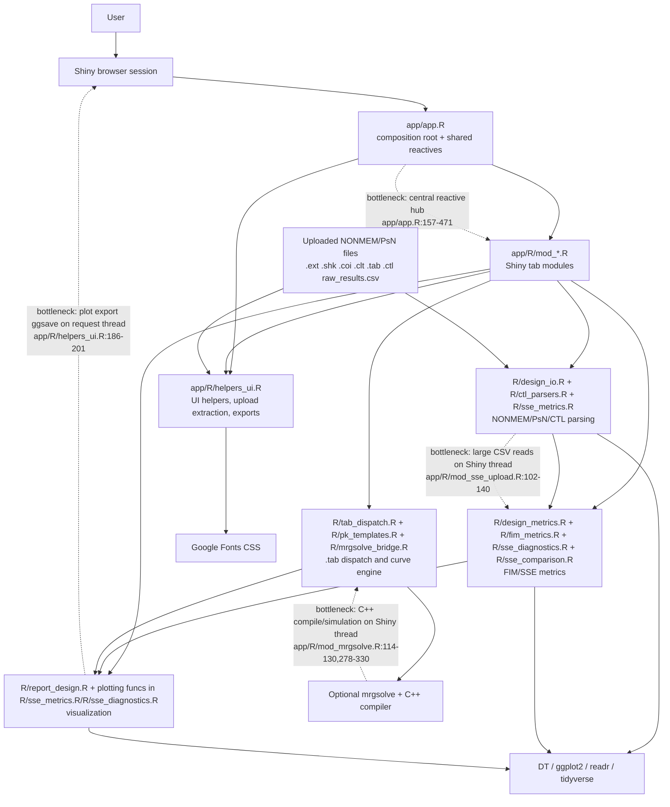

# Initial Software Design Architecture Analysis

Date: 2026-04-29

Scope reviewed: `README.md`, `DESCRIPTION`, `app/app.R`, `app/R/*.R`, `R/*.R`, `tests/`, and the existing review note at `docs/codebase-review-2026-04-29.md`.

## Executive Summary

This project is a modular Shiny monolith with a layered helper-core architecture. It is not MVC in the classical web-framework sense, and it is not microservices. The closest pattern is a layered architecture:

- Presentation layer: `app/app.R`, `app/R/mod_*.R`, `app/R/helpers_ui.R`, `app/www/styles.css`.
- Application orchestration layer: `app/app.R` server reactives and Shiny module wiring.
- Domain/data layer: `R/design_io.R`, `R/design_metrics.R`, `R/ctl_parsers.R`, `R/fim_metrics.R`, `R/sse_metrics.R`, `R/sse_diagnostics.R`, `R/tab_dispatch.R`, etc.
- External/runtime integrations: NONMEM/PsN text outputs uploaded as files, optional `mrgsolve`/C++ compilation, Google Fonts, Shiny/DT/ggplot/readr/tidyverse packages.

Separation of concerns is mostly clear at the folder level, but several files cross too many boundaries internally. The largest risks are not circular dependencies; they are hidden global dependencies caused by `source()` order, large mixed-responsibility modules, duplicated parsing/filtering logic, and synchronous heavy work inside Shiny reactives.

Modularity rating: **6/10**.

Justification: the app is already split into many Shiny modules and reusable pure-R functions, which is good. The rating is held back by god modules (`R/sse_metrics.R`, `R/report_design.R`, `app/R/mod_sse_validation.R`, `app/app.R`), implicit load-order coupling between pure-R files, and repeated SSE/label/true-value plumbing.

## Architecture Diagram



## Evaluation

1. **Is there clear separation of concerns?**

   Partially. Folder-level separation is strong: pure R helpers are under `R/`, Shiny modules are under `app/R/`, and `app/app.R` wires the system. Evidence: `README.md` documents this split, and `app/app.R:51-63` sources pure helpers before `app/app.R:65-67` sources Shiny modules.

   The internal separation is weaker in large files. For example, `R/sse_metrics.R` handles PsN column normalization, raw/summary file parsing, `.ctl` true-value parsing, metric computation, D-criterion diagnostics, and plotting (`R/sse_metrics.R:41`, `R/sse_metrics.R:164`, `R/sse_metrics.R:190`, `R/sse_metrics.R:351`, `R/sse_metrics.R:573`, `R/sse_metrics.R:674`, `R/sse_metrics.R:845`, `R/sse_metrics.R:1024`, `R/sse_metrics.R:1109`). `R/report_design.R` similarly mixes generic theme helpers, FIM/RI/RSE plots, optimal-time plots, and PK-profile rendering (`R/report_design.R:48`, `R/report_design.R:174`, `R/report_design.R:251`, `R/report_design.R:570`, `R/report_design.R:748`, `R/report_design.R:937`, `R/report_design.R:1132`).

2. **Which architectural pattern is used?**

   The architecture is a **layered modular monolith**:

   - Shiny UI/controller modules: `app/R/mod_upload.R`, `app/R/mod_times.R`, `app/R/mod_sse_validation.R`, etc.
   - Domain/data functions: `R/design_io.R`, `R/design_metrics.R`, `R/fim_metrics.R`, `R/sse_metrics.R`, `R/tab_dispatch.R`.
   - Composition root: `app/app.R`.

   It is not MVC in a strict sense because Shiny modules combine view and controller responsibilities. It is not microservices because there are no independent deployable services.

3. **Are there God objects or modules doing too much?**

   Yes. Main candidates:

   - `R/sse_metrics.R`: parse + compute + compare + plot in one file.
   - `R/report_design.R`: broad plotting kitchen sink for unrelated plot families.
   - `app/R/mod_sse_validation.R`: long UI methodology content plus reactive analytics, plots, tables, and export wiring.
   - `app/app.R`: source loader, logger, full UI, upload/example orchestration, merged run context, label parsing, and module composition.

4. **Is dependency flow clean, with no circular dependencies?**

   Static `source()` flow appears acyclic. `app/app.R` sources helper files in a fixed sequence at `app/app.R:51-63`, then sources Shiny modules at `app/app.R:65-67`. I found no reciprocal `source()` statements inside `R/*.R` or `app/R/*.R`.

   However, dependency flow is not fully clean because several files rely on globally sourced functions from earlier files instead of explicit imports or package namespaces:

   - `R/report_design.R:10` documents prerequisites and later calls `get_rse()` at `R/report_design.R:831` and `R/report_design.R:886`.
   - `R/sse_metrics.R:615`, `R/sse_metrics.R:801`, `R/sse_metrics.R:980`, and `R/sse_metrics.R:993` call `.param_type()` from `R/design_metrics.R:70`.
   - `R/sse_diagnostics.R:41` calls `.normalize_psn_cols()` from `R/sse_metrics.R:41`.
   - `R/sse_diagnostics.R:589` calls `compute_sse_metrics()` from `R/sse_metrics.R:573`.

   Unable to verify: runtime reactive cycles. I did not run a live Shiny dependency graph. The static code does not show a direct circular source dependency.

5. **Modularity rating**

   **6/10**.

   Strengths: many tab-level modules, reusable parser/metric functions, centralized SSE upload (`app/R/mod_sse_upload.R:1-7`), shared plot export helper (`app/R/helpers_ui.R:185-201`), and a dedicated `.tab` dispatcher (`R/tab_dispatch.R:22`, `R/tab_dispatch.R:77`).

   Weaknesses: global source-order coupling, oversized mixed-purpose files, ad-hoc run objects, duplicated true-value/label/SSE parsing paths, and central state concentration in `app/app.R`.

## Structured Findings

### Finding 1: Hidden global load-order dependencies in pure R helpers

Importance: **8/10**

Evidence:

- `app/app.R:51-63` defines a required source order for core files.
- `R/report_design.R:10` says it requires `design_utils.R`, `design_io.R`, and `design_metrics.R`, then calls `get_rse()` at `R/report_design.R:831` and `R/report_design.R:886`.
- `R/sse_metrics.R:615` calls `.param_type()` from `R/design_metrics.R:70`.
- `R/sse_diagnostics.R:41` calls `.normalize_psn_cols()` from `R/sse_metrics.R:41`.
- `R/sse_diagnostics.R:589` calls `compute_sse_metrics()` from `R/sse_metrics.R:573`.

Anti-patterns: tight coupling, missing explicit abstractions.

Risk: tests or scripts that source a single helper file can fail unless they know the same implicit order as `app/app.R`.

Drop-in remediation:

```r
# app/app.R
source_core <- function(root = "..") {
  core_files <- c(
    "design_utils.R",
    "design_io.R",
    "design_metrics.R",
    "design_summary.R",
    "ctl_parsers.R",
    "report_design.R",
    "fim_metrics.R",
    "sse_metrics.R",
    "sse_diagnostics.R",
    "sse_comparison.R",
    "mrgsolve_bridge.R",
    "pk_templates.R",
    "tab_dispatch.R"
  )
  invisible(lapply(file.path(root, "R", core_files), source, local = TRUE))
}

source_core("..")
```

Then use the same loader in test/bootstrap scripts instead of repeating source order manually. Longer term, add `NAMESPACE`/roxygen exports so helper dependencies are resolved as package functions instead of source-order globals.

### Finding 2: `R/sse_metrics.R` is a god module

Importance: **8/10**

Evidence:

- Column normalization: `.normalize_psn_cols()` at `R/sse_metrics.R:41`.
- Format dispatch: `read_sse_auto()` at `R/sse_metrics.R:164`.
- Summary parsing: `read_sse_summary()` at `R/sse_metrics.R:190`.
- Raw parsing: `read_sse_raw()` at `R/sse_metrics.R:299`.
- `.ctl` true-value parsing: `read_true_values()` at `R/sse_metrics.R:351`.
- Metric computation: `compute_sse_metrics()` at `R/sse_metrics.R:573`.
- Empirical D/generalized variance: `compute_empirical_d_criterion()` at `R/sse_metrics.R:674`.
- Comparison: `compare_fim_sse()` at `R/sse_metrics.R:783`.
- Plotting: `plot_fim_vs_sse()` at `R/sse_metrics.R:845`, `plot_ree_boxplot()` at `R/sse_metrics.R:1024`, `plot_rse_bar()` at `R/sse_metrics.R:1109`.

Anti-patterns: god module, missing abstractions.

Risk: parsing changes can accidentally affect plotting and vice versa; review/test scope becomes too wide for small changes.

Drop-in remediation:

Split by concern without changing function names:

```text
R/sse_io.R              # .normalize_psn_cols(), read_sse_auto(), read_sse_summary(), read_sse_raw()
R/ctl_true_values.R     # read_true_values() and its private helpers
R/sse_metrics.R         # compute_sse_metrics(), compute_empirical_d_criterion(), compare_fim_sse()
R/sse_plots.R           # plot_fim_vs_sse(), compute_ree_distribution(), plot_ree_boxplot(), plot_rse_bar()
```

Update `app/app.R:58-60` to source these files in that order.

### Finding 3: `R/report_design.R` is a broad plotting god module

Importance: **7/10**

Evidence:

- Shared theme/helpers: `.theme_design()` at `R/report_design.R:48`.
- RI and RSE plots: `plot_relativeinf()` at `R/report_design.R:174`, `plot_rse()` at `R/report_design.R:251`.
- Convergence/FIM plots: `plot_convergence()` at `R/report_design.R:348`, `plot_fim_heatmap()` at `R/report_design.R:570`.
- Optimal-time plots: `plot_optimal_times()` at `R/report_design.R:748`.
- PK/PD prediction plots: `plot_model_prediction()` at `R/report_design.R:937`, `plot_pk_profile()` at `R/report_design.R:1132`.

Anti-patterns: god module.

Risk: unrelated plotting domains are coupled into one high-conflict file. The Optimal Times branch can churn the same file as FIM, RSE, and SSE visualization work.

Drop-in remediation:

```text
R/plot_theme.R          # .theme_design(), .empty_plot(), shared palettes
R/plot_design_metrics.R # plot_relativeinf(), plot_rse(), plot_se(), plot_rse_waterfall()
R/plot_fim.R            # plot_fim_heatmap(), plot_empirical_cor_heatmap(), plot_eigenvalue_spectrum()
R/plot_times.R          # plot_optimal_times(), plot_model_prediction(), plot_pk_profile()
R/plot_convergence.R    # plot_convergence(), build_convergence_steps(), plot_convergence_steps()
```

Keep the function names stable so modules like `app/R/mod_rse.R:47-52` and `app/R/mod_times.R:357-385` do not need behavioral rewrites.

### Finding 4: `app/app.R` is both composition root and state/orchestration hub

Importance: **7/10**

Evidence:

- Logger is defined in `app/app.R:29-45`.
- Source loading is in `app/app.R:51-67`.
- Full navbar UI is in `app/app.R:74-150`.
- Example/upload loading state is in `app/app.R:180-276`.
- Merged run state is in `app/app.R:278-338`.
- Label parsing is in `app/app.R:342-365`.
- Module server composition is in `app/app.R:374-470`.

Anti-patterns: god module, tight coupling.

Risk: small changes to upload/example behavior, labels, or shared context require editing the composition root. That increases accidental regression risk across tabs.

Drop-in remediation:

Extract low-level repeated state helpers into `app/R/helpers_ui.R` or a new app helper file:

```r
parse_mapping_text <- function(raw) {
  raw <- trimws(raw %||% "")
  if (raw == "") return(NULL)

  out <- tibble::tibble(raw = strsplit(raw, "\n")[[1]]) |>
    dplyr::filter(stringr::str_detect(raw, "=")) |>
    tidyr::separate(raw, into = c("key", "val"), sep = "=", extra = "merge") |>
    dplyr::mutate(dplyr::across(dplyr::everything(), trimws)) |>
    dplyr::filter(nchar(key) > 0, nchar(val) > 0) |>
    tibble::deframe()

  if (length(out) == 0L) NULL else out
}
```

Then replace `app/app.R:342-365` with:

```r
param_labels_r <- reactive(parse_mapping_text(input$param_labels))
cmt_labels_r   <- reactive(parse_mapping_text(input$cmt_labels))
```

### Finding 5: SSE raw-reading logic is duplicated

Importance: **7/10**

Evidence:

- `R/sse_metrics.R:299-335` implements `read_sse_raw()`, reads CSV, normalizes columns, and filters successful minimizations.
- `R/sse_diagnostics.R:25-58` implements `read_sse_raw_all()`, reads CSV, normalizes columns, and preserves all rows with a `converged` flag.

Anti-patterns: copy-paste programming.

Risk: changes to PsN column handling or CSV fallback can diverge between Validation and Analysis paths.

Drop-in remediation:

Add one private reader and make both public functions wrappers:

```r
.read_sse_raw_base <- function(file) {
  if (!file.exists(file)) stop("SSE file not found: ", file)

  if (requireNamespace("readr", quietly = TRUE)) {
    raw <- suppressWarnings(suppressMessages(
      readr::read_csv(file, show_col_types = FALSE, progress = FALSE,
                      guess_max = 10000)
    ))
    raw <- as.data.frame(raw, check.names = FALSE)
  } else {
    raw <- read.csv(file, stringsAsFactors = FALSE, check.names = FALSE)
  }

  names(raw) <- .normalize_psn_cols(names(raw))
  raw
}

read_sse_raw <- function(file) {
  raw <- .read_sse_raw_base(file)
  n_total <- nrow(raw)
  pre_filtered <- !("minimization_successful" %in% names(raw))

  if (!pre_filtered) {
    raw$minimization_successful <- as.numeric(raw$minimization_successful)
    raw <- raw[!is.na(raw$minimization_successful) &
                 raw$minimization_successful == 1, , drop = FALSE]
  }

  result <- tibble::as_tibble(raw)
  attr(result, "n_total") <- n_total
  attr(result, "n_success") <- nrow(raw)
  attr(result, "pre_filtered") <- pre_filtered
  result
}
```

Then implement `read_sse_raw_all()` from `.read_sse_raw_base()` and only add the `converged` column there.

### Finding 6: True-value resolution is duplicated across SSE modules

Importance: **5/10**

Evidence:

- `app/R/mod_sse_validation.R:454-463` resolves true values from `shared_true_vals()` or `shared_ctl_lines()`.
- `app/R/mod_sse_comparison.R:147-156` repeats the same fallback.
- `app/app.R:299-303` also computes `merged_true_vals`.

Anti-patterns: copy-paste programming, tight coupling.

Risk: future `.ctl` parsing policy changes must be applied in multiple places.

Drop-in remediation:

```r
resolve_true_values <- function(shared_true_vals, shared_ctl_lines) {
  sv <- shared_true_vals()
  if (!is.null(sv) && length(sv) > 0L) return(sv)

  cl <- shared_ctl_lines()
  if (is.null(cl)) return(NULL)

  vals <- read_true_values(cl)
  if (length(vals) == 0L) NULL else vals
}
```

Use:

```r
true_vals <- reactive(resolve_true_values(shared_true_vals, shared_ctl_lines))
```

### Finding 7: The table selector is owned by the Power tab but drives unrelated tabs

Importance: **6/10**

Evidence:

- `app/app.R:374-387` says `mod_power` owns `table_no + groupsize`.
- The returned `tbl_no` is passed to Parameters/RSE/RELATIVEINF/FIM/SSE Validation at `app/app.R:389-406` and `app/app.R:431-442`.

Anti-patterns: tight coupling.

Risk: a Decision/Power UI concern controls Results, Design, and Validation behavior. This makes table selection harder to reason about and test.

Drop-in remediation:

Move `tbl_no` to app-level shared context and let `mod_power` consume it rather than own it:

```r
# app/app.R, near shared reactives
selected_table_no <- reactiveVal(NULL)
tbl_no <- reactive(selected_table_no())

# pass selected_table_no to whichever module renders the selector
power_out <- mod_power_server(
  "power",
  ext_data = merged_ext,
  param_labels = param_labels_r,
  suggested_groupsize = suggested_gs,
  table_no_range = examples$table_no_range,
  reset_trigger = reset_trigger,
  all_runs = all_runs,
  selected_table_no = selected_table_no
)
```

This keeps table context owned by the app/run context, not by a single tab.

### Finding 8: Shiny modules mix UI text, reactive orchestration, analytics, and export wiring

Importance: **6/10**

Evidence:

- `app/R/mod_sse_validation.R:10-392` builds a long UI/methodology panel.
- The same file computes active SSE data and metrics at `app/R/mod_sse_validation.R:430-495`.
- It renders matrix diagnostics at `app/R/mod_sse_validation.R:551-623`, eigen/correlation plots at `app/R/mod_sse_validation.R:630-666`, and scatter/REE/RSE outputs at `app/R/mod_sse_validation.R:668-735`.
- `app/R/mod_sse_analysis.R:177-420` has a similar mix of data selection, metric computation, plots, tables, and CSV export.

Anti-patterns: god module, missing abstractions.

Risk: UI copy, scientific computation, and export behavior are reviewed/tested together even when the change is isolated.

Drop-in remediation:

Extract UI fragments first, since this is low-risk:

```r
sse_validation_methodology_ui <- function() {
  tags$details(
    style = paste0(
      "border:1px solid #ccc; border-radius:8px; padding:10px 14px;",
      " margin-bottom:14px; background:#f9f9fb;"
    ),
    tags$summary(style = "cursor:pointer; font-weight:600; font-size:0.95em;",
                 "Methodology and formulas"),
    # existing contents from app/R/mod_sse_validation.R:45-392
  )
}
```

Then replace `app/R/mod_sse_validation.R:37-392` with `sse_validation_methodology_ui()`.

### Finding 9: Run objects are ad-hoc lists instead of a small stable data contract

Importance: **6/10**

Evidence:

- `app/app.R:308-325` constructs run lists with keys like `name`, `ext_data`, `shk_data`, `coi_data`, `clt_data`, `tab_data`, `cpu_data`.
- `app/R/mod_compare.R` returns similar structures through `comp_runs`.
- Multiple modules rely on this shape through `all_runs`, for example `app/R/mod_times.R:364-370` and `app/R/mod_fim.R:12`.

Anti-patterns: missing abstraction, tight coupling.

Risk: adding a run field, renaming a field, or validating required files has no single contract point.

Drop-in remediation:

```r
new_design_run <- function(name = "Primary", ext_data = NULL, shk_data = NULL,
                           coi_data = NULL, clt_data = NULL, tab_data = NULL,
                           cpu_data = NA_real_) {
  list(
    name = name,
    ext_data = ext_data,
    shk_data = shk_data,
    coi_data = coi_data,
    clt_data = clt_data,
    tab_data = tab_data,
    cpu_data = cpu_data %||% NA_real_
  )
}
```

Then replace the literal list construction in `app/app.R:309-325` with `new_design_run(...)`.

### Finding 10: Heavy parsing/compilation/plot export happens synchronously in Shiny request paths

Importance: **7/10**

Evidence:

- SSE CSV parsing happens inside upload observers: `app/R/mod_sse_upload.R:102-123` and `app/R/mod_sse_upload.R:127-140`.
- mrgsolve compilation happens inside an observer: `app/R/mod_mrgsolve.R:114-130`, calling `compile_mrgsolve_model()` at `R/mrgsolve_bridge.R:300-317`.
- mrgsolve simulation happens inside an observer: `app/R/mod_mrgsolve.R:278-330`, calling `simulate_pk_profile()` at `R/mrgsolve_bridge.R:334-370`.
- Plot export uses `ggplot2::ggsave()` inside a download handler at `app/R/helpers_ui.R:186-201`.

Anti-patterns: potential bottleneck, tight UI/runtime coupling.

Risk: large raw SSE files, C++ compilation, or large plot exports can block the Shiny session.

Drop-in remediation:

At minimum, cache expensive reactive computations per uploaded path and avoid repeated work:

```r
sse_cache <- reactiveVal(list(path = NULL, data = NULL))

observeEvent(input$sse_a, {
  req(input$sse_a)
  path <- input$sse_a$datapath
  cached <- sse_cache()
  if (identical(cached$path, path)) {
    sse_a_raw(cached$data)
    return()
  }
  dat <- read_sse_raw_all(path)
  sse_cache(list(path = path, data = dat))
  sse_a_raw(dat)
})
```

For larger production use, move CSV parsing and mrgsolve compilation to async futures/promises or an explicit background job queue.

## Anti-Pattern Inventory

| Anti-pattern | Status | Evidence |
|---|---:|---|
| Spaghetti code | Partial | Not pervasive; tab modules are separated. The densest spaghetti risk is the central reactive hub in `app/app.R:157-471`. |
| Copy-paste programming | Present | `read_sse_raw()` vs `read_sse_raw_all()` (`R/sse_metrics.R:299-335`, `R/sse_diagnostics.R:25-58`); true-value fallback duplicated (`app/R/mod_sse_validation.R:454-463`, `app/R/mod_sse_comparison.R:147-156`); label mapping duplicated (`app/app.R:342-365`). |
| God classes/modules | Present | `R/sse_metrics.R`, `R/report_design.R`, `app/R/mod_sse_validation.R`, `app/app.R`. |
| Tight coupling | Present | Source-order globals (`app/app.R:51-63`), Power-owned `tbl_no` shared across tabs (`app/app.R:374-387`), modules depending on global `log_error()` (`app/R/mod_upload.R:67-73` with logger in `app/app.R:33-45`). |
| Missing abstractions | Present | No stable run object constructor (`app/app.R:308-325`); no shared true-value resolver; no shared label text parser. |

## Dependency Flow Notes

Clean:

- `app/app.R` acts as the composition root.
- There are no discovered `source()` cycles inside helper files.
- Shiny modules generally consume data through injected reactives rather than reading global files directly.

Needs improvement:

- Several helpers call functions defined in earlier-sourced files with no explicit namespace or contract.
- Some `library()` calls are repeated inside helpers (`R/design_io.R:21-25`, `R/design_metrics.R:25-28`, `R/report_design.R:14-17`, `R/sse_metrics.R:18-21`) instead of package-level imports.
- `app/R/mod_upload.R:67-73` depends on `log_error()` existing globally from `app/app.R:43-45`.

## Concrete Priority Plan

1. Extract duplicated low-risk helpers:
   - `parse_mapping_text()` for `app/app.R:342-365`.
   - `resolve_true_values()` for SSE modules.
   - `.read_sse_raw_base()` for raw SSE readers.

2. Stabilize dependency loading:
   - Introduce one `source_core()` helper used by `app/app.R` and tests.
   - Or complete the R package structure with `NAMESPACE` and explicit exported/internal functions.

3. Split god modules without changing public function names:
   - Split `R/sse_metrics.R` by IO/metrics/plots.
   - Split `R/report_design.R` by plot domain.

4. Move table selection out of `mod_power_server()` ownership into app/run context.

5. Add module-level tests for the most coupled reactive contracts:
   - Upload/reset path.
   - `tbl_no` propagation.
   - SSE A/B shared upload consumption.
   - True-value resolution fallback.

